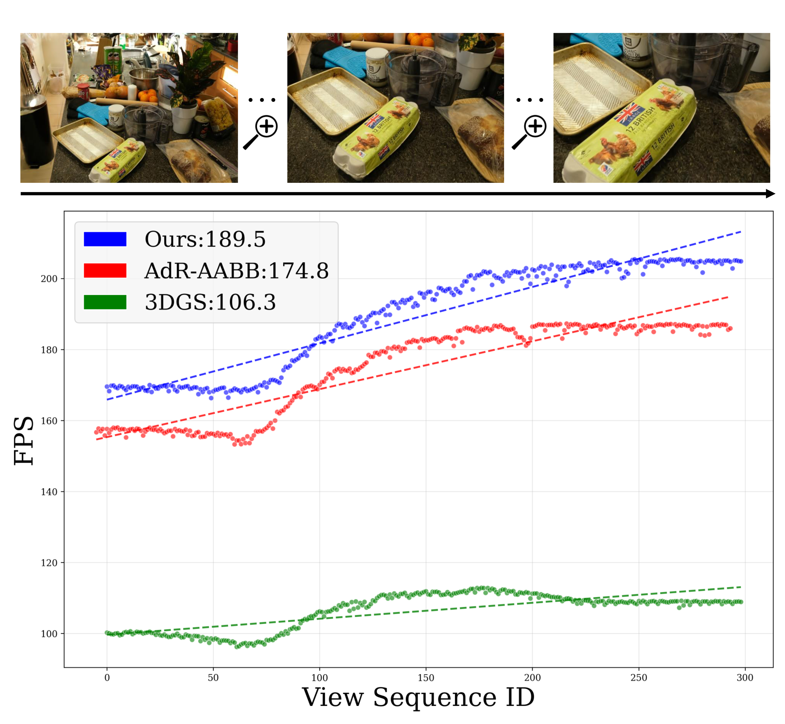
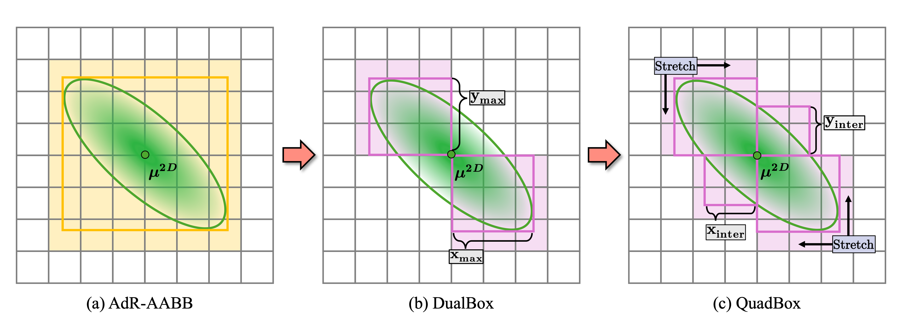
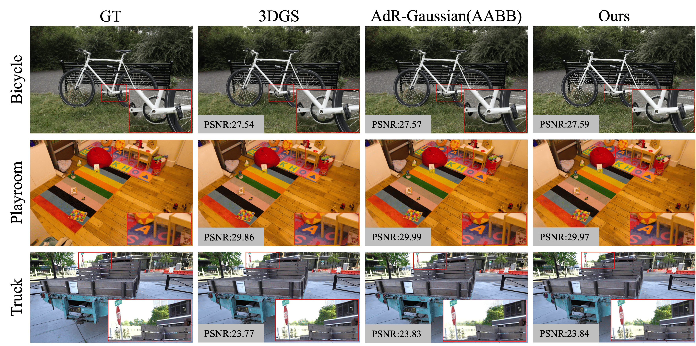

<div align="center">
<h2> QuadBox: Accelerating 3D Gaussian Splatting with Geometry-Aware Boxes </h2>
<p align="center">
  <a href="https://arxiv.org/abs/2603.17625"></a>
  <a href="https://github.com/Powertony102/QuadGaussian"></a>
</p>
<p align="center">
  <a href="https://xinzelicv.github.io/">Xinze Li</a><sup>1</sup>, Bohan Yang<sup>1</sup> Pengxu Chen<sup>1,2</sup>, Yiyuan Wang<sup>1,3</sup>, Hongcheng Luo <sup>4</sup>
  Weifeng Su<sup>1,5</sup>,<a href="https://wtchengcv.github.io/">Wentao Cheng</a><sup>1†</sup>
</p>
<p align="center">
  <sup>1</sup>Beijing Normal University–Hong Kong Baptist University &nbsp;&nbsp;
  <sup>2</sup>Jilin University &nbsp;&nbsp;
  <sup>3</sup>Hong Kong Baptist University &nbsp;&nbsp;
  <sup>4</sup>Xiaomi Group Ltd. &nbsp;&nbsp;
  <sup>5</sup>Guangdong Provincial Key Laboratory of Interdisciplinary Research and Application for Data Science
</p>
<p align="center">
  <a href="https://bnbu.edu.cn/"> </a>
  <a href="https://www.jlu.edu.cn/"> </a>
  <a href="https://www.hkbu.edu.hk/en.html"> </a>
  <svg data-v-777bda80="" xmlns="http://www.w3.org/2000/svg" viewBox="0 0 808 808" class="mi-logo" height="100"><g data-v-777bda80=""><path data-v-777bda80="" fill="#ff6900" d="M723.79,84.42C647.55,8.48,537.94,0,404,0,269.89,0,160.12,8.58,83.92,84.72S0,270.43,0,404.39,7.74,648,84,724.14,269.9,808,404,808s243.85-7.71,320-83.86,84-185.78,84-319.75C808,270.25,800.16,160.54,723.79,84.42Z"></path> <path data-v-777bda80="" fill="#fff" d="M374.26,553.72a5,5,0,0,1-5.06,5H300.3a5.05,5.05,0,0,1-5.12-5V373.53a5.05,5.05,0,0,1,5.12-5h68.9a5,5,0,0,1,5.06,5Z"></path> <path data-v-777bda80="" fill="#fff" d="M509.18,553.72a5.05,5.05,0,0,1-5.09,5H438.5a5,5,0,0,1-5.1-5V398.26c-.07-27.15-1.62-55-15.64-69.06-12-12.09-34.51-14.86-57.88-15.44H241a5,5,0,0,0-5.07,5v235a5.07,5.07,0,0,1-5.12,5H165.16a5,5,0,0,1-5.06-5V254.31a5,5,0,0,1,5.06-5H354.52c49.49,0,101.22,2.26,126.74,27.81s27.92,77.3,27.92,126.85Z"></path> <path data-v-777bda80="" fill="#fff" d="M644.29,553.72a5.06,5.06,0,0,1-5.09,5H573.57a5,5,0,0,1-5.08-5V254.31a5,5,0,0,1,5.08-5H639.2a5.06,5.06,0,0,1,5.09,5Z"></path></g></svg>
  <a href="https://irads.bnbu.edu.cn/"> </a>
</p>
<p align="center">
  <sup>†</sup>Corresponding Author
</p>

<p align="center">
  Contact: t330026083@mail.bnbu.edu.cn
</p>
</div>

<p align="center">

</p>

## 📰 News

- [Apr 29, 2026] Code Released
- [Apr 29, 2026] 🎉 QuadBox has been accepted to ICIP 2026.

## 🔭 Overview

QuadBox introduces a geometry-aware four-box approximation and efficient single-pass traversal (QPass) to significantly reduce redundant Gaussian–tile intersections, accelerating 3D Gaussian Splatting rendering by up to ~1.85× without sacrificing quality

<p align="center">

</p>

## ⚙️ Setup

Follow the setup instructions for the original [3D-GS](https://github.com/graphdeco-inria/gaussian-splatting) codebase. Our code changes are made in (1) the differential renderer submodule and (2) the Python files in this repo.

After cloning, initialize the submodules and install dependencies:

```bash
git submodule update --init --recursive
pip install -e submodules/diff-gaussian-rasterization
pip install -e submodules/simple-knn
pip install -e submodules/fused-ssim
```

## 🏃 Running

To train a scene:

```bash
python train.py -s <path_to_colmap_or_nerf_dataset> -m <output_model_path> --eval
```

To render a trained model:

```bash
python render.py -s <path_to_dataset> -m <output_model_path> --iteration 30000
```

To evaluate rendered images (PSNR / SSIM / LPIPS):

```bash
python full_eval.py --mipnerf360 <path_to_mipnerf360> --tanksandtemples <path_to_tandt> --deepblending <path_to_db>
```

## 📈 Result
<p align="center">

</p>